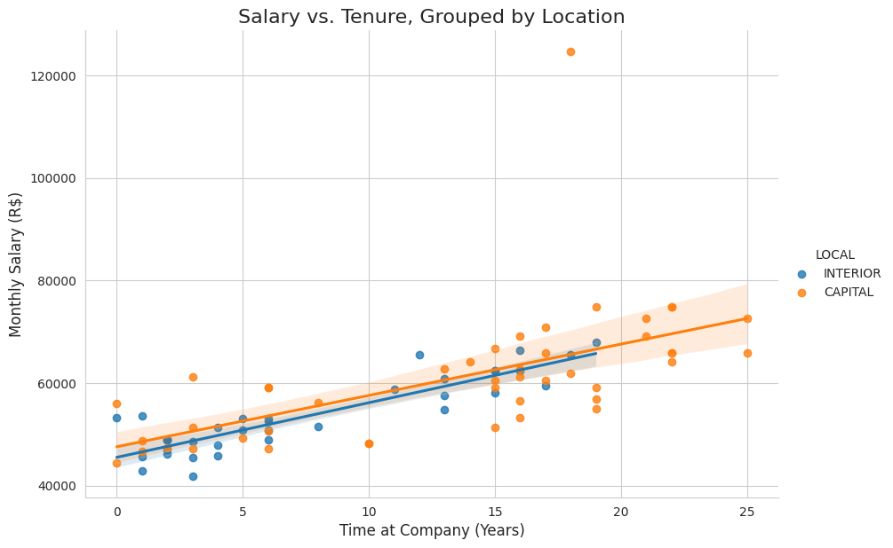

<p align="center">
  
  
  
  
  
  
  
</p>

<h1 align="center">Case de Estudo Técnico para Cientista de Dados</h1>

<p align="center">
    
</p>

Este repositório apresenta a solução para um case técnico para a posição de Cientista de Dados, abordando desafios práticos em Sistemas de Recomendação, Processamento de Linguagem Natural (PNL), Inferência Causal e Análise de Regressão.

**Autor:** Carlos Vinícius Nascimento de Jesus  
**LinkedIn:** [https://www.linkedin.com/in/carlos-vinicius-nascimento-de-jesus/]

---

## 📝 Visão Geral do Projeto

Este projeto está dividido em três problemas de negócio distintos, cada um com uma abordagem analítica específica para gerar valor e insights.

### **Problema 1: Sistema de Recomendação e PNL para Varejo (Monoprix)**
* **Objetivo:** Desenvolver um algoritmo de recomendação inteligente para uma lista de compras por voz, sugerindo produtos que os clientes possam ter esquecido.
* **Solução Proposta:**
    1.  **Motor de Recomendação:** Foi proposto um sistema híbrido e ciente de sequência, combinando Filtragem Colaborativa (item-a-item), modelos de sequência (como LSTMs/Transformers) e Filtragem Baseada em Conteúdo para gerar sugestões personalizadas e contextuais.
    2.  **Limpeza do Catálogo com PNL:** Para lidar com um catálogo de produtos com nomes inconsistentes, foi desenvolvido um pipeline de PNL escalável, utilizando normalização de texto, vetorização semântica (com Sentence-BERT) e clusterização não supervisionada (HDBSCAN) para agrupar e padronizar os nomes dos produtos.

### **Problema 2: Análise de Efetividade de Campanha de Marketing**
* **Objetivo:** Aconselhar uma empresa farmacêutica sobre como mensurar o impacto causal de uma campanha de marketing nas vendas.
* **Solução Proposta:**
    * [cite_start]**Produto Existente:** Utilização do método de **Diferença em Diferenças (DiD)** para isolar o efeito da campanha, comparando uma região de tratamento com uma região de controle, antes e depois da intervenção.
    * [cite_start]**Novo Produto:** Proposição de uma **Regressão Cross-Sectional com Variáveis de Controle**, permitindo medir o efeito da campanha de lançamento ao controlar por variáveis regionais que poderiam influenciar as vendas (demografia, acesso ao mercado, etc.).

### **Problema 3: Análise de Igualdade Salarial**
* [cite_start]**Objetivo:** Verificar se uma rede de supermercados cumpre sua política interna de não discriminação salarial com base na localidade dos funcionários (Capital vs. Interior).
* **Solução Implementada:**
    * [cite_start]Realizada uma análise completa em Python, incluindo limpeza e tratamento dos dados salariais, análise exploratória (EDA) e testes de hipótese (Mann-Whitney U).
    * [cite_start]Construído um modelo de **Regressão Linear Múltipla** para controlar por variáveis de confusão (cargo, tempo de casa, idade e educação), confirmando que a localidade, por si só, não era um fator estatisticamente significante na determinação dos salários.

---

## 🛠️ Habilidades e Tecnologias

* **Conceitos Principais:** Sistemas de Recomendação, Processamento de Linguagem Natural (PNL), Inferência Causal, Análise de Regressão, Testes de Hipótese, Análise Exploratória de Dados (EDA).
* **Modelos e Técnicas:**
    * **RecSys & PNL:** Filtragem Colaborativa, LSTMs, BERT4Rec, Sentence-BERT, Clusterização (HDBSCAN), Fuzzy Matching.
    * **Inferência Causal:** Diferença em Diferenças (DiD), Regressão Controlada.
    * **Estatística:** Regressão Linear Múltipla (OLS), Teste U de Mann-Whitney, Teste t, Análise de Sensibilidade.
* **Ferramentas:** Python, Pandas, Matplotlib, Seaborn, Scipy, Statsmodels, Google Colab.

---

## 🚀 Como Executar o Projeto

1.  Clone este repositório:
    ```bash
    git clone [https://github.com/seu-usuario/data-science-technical-case.git](https://github.com/seu-usuario/data-science-technical-case.git)
    ```
2.  Navegue até o diretório do projeto e crie um ambiente virtual:
    ```bash
    cd data-science-technical-case
    python -m venv venv
    source venv/bin/activate  # No Windows, use `venv\Scripts\activate`
    ```
3.  Instale as dependências necessárias:
    ```bash
    pip install -r requirements.txt
    ```
4.  Abra o Jupyter Notebook para visualizar a análise completa.
    ```bash
    jupyter notebook Carlos_Vinícius_Nascimento_de_Jesus_Pessoa_Cientista_de_Dados.ipynb
    ```

---
*Este projeto foi desenvolvido como parte de um processo seletivo para a vaga de Cientista de Dados.*
