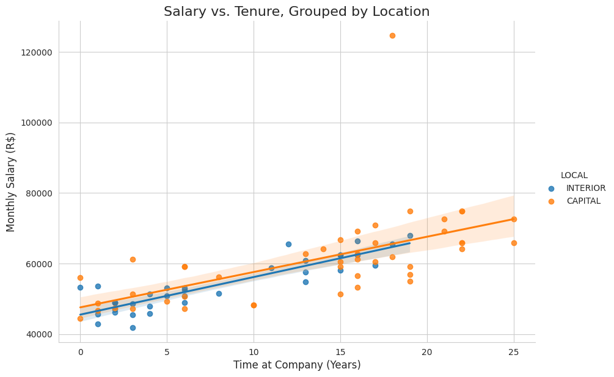

<p align="center">
  
  
  
  
  
  
  
</p>

<h1 align="center">Data Scientist Technical Case Study</h1>

<p align="center">
  
</p>
[🇧🇷 Ver este README em Português](./README-PT.md)


This repository contains a comprehensive solution to a technical case study for a Data Scientist position, covering topics in recommendation systems, natural language processing (NLP), causal inference, and regression analysis.

---

## 📝 Project Overview

This project is divided into three distinct business problems:

### **Problem 1: Predictive Shopping List for Monoprix**
* **Objective:** Develop a recommendation algorithm to suggest products that customers might have forgotten to add to their smart speaker-based shopping list.
* **Solution:** Proposed a hybrid, sequence-aware recommendation system combining Collaborative Filtering, sequence models (LSTM/Transformers), and Content-Based Filtering. Additionally, developed a scalable NLP pipeline to clean and standardize a messy product catalog using techniques like text normalization, semantic vectorization (Sentence-BERT), and unsupervised clustering (HDBSCAN).

### **Problem 2: Measuring Marketing Campaign Effectiveness**
* **Objective:** Advise a pharmaceutical company on how to measure the sales impact of a marketing campaign.
* **Solution:**
    * For an existing product with stable demand, a **Difference-in-Differences (DiD)** model was proposed to establish causal impact by comparing a treatment region with a control region, before and after the campaign.
    * For a new product launch, a **Cross-Sectional Regression with Control Variables** was proposed to measure the campaign's effect by controlling for regional confounders (demographics, market access, etc.).

### **Problem 3: Supermarket Salary Equality Analysis**
* **Objective:** Verify if a supermarket company's policy of non-discriminatory salaries based on employee location (Capital vs. Interior) is being followed.
* **Solution:** A multi-step analysis was performed using Python. This included data cleaning, exploratory data analysis (EDA), and statistical testing (Mann-Whitney U). A **Multiple Linear Regression** model was built to control for confounding variables like job role, tenure, age, and education, ultimately isolating the effect of location on salary.

---

## 🛠️ Key Skills & Technologies Demonstrated

* **Core Concepts:** Recommendation Systems, NLP, Causal Inference, Statistical Analysis, Regression Modeling, Hypothesis Testing.
* **Models & Techniques:**
    * **RecSys & NLP:** Collaborative Filtering, LSTMs, Transformers (BERT4Rec), Sentence-BERT, TF-IDF, HDBSCAN, Fuzzy Matching.
    * **Causal Inference:** Difference-in-Differences (DiD), Controlled Regression.
    * **Statistics:** Multiple Linear Regression (OLS), Mann-Whitney U Test, t-Test, Sensitivity Analysis.
* **Technologies:** Python, Pandas, Matplotlib, Seaborn, Scipy, Statsmodels.

---

## 🚀 How to Run

1.  Clone this repository:
    ```bash
    git clone [https://github.com/seu-usuario/seu-repositorio.git](https://github.com/seu-usuario/seu-repositorio.git)
    ```
2.  Navigate to the project directory and create a virtual environment:
    ```bash
    cd your-repo
    python -m venv venv
    source venv/bin/activate  # On Windows, use `venv\Scripts\activate`
    ```
3.  Install the required dependencies:
    ```bash
    pip install -r requirements.txt
    ```
4.  Open the Jupyter Notebook located in the `notebooks/` directory to view the analysis.
    ```bash
    jupyter notebook notebooks/data_science_case_study.ipynb
    ```

---

*This project was completed as part of a selective process for a Data Scientist role.*


